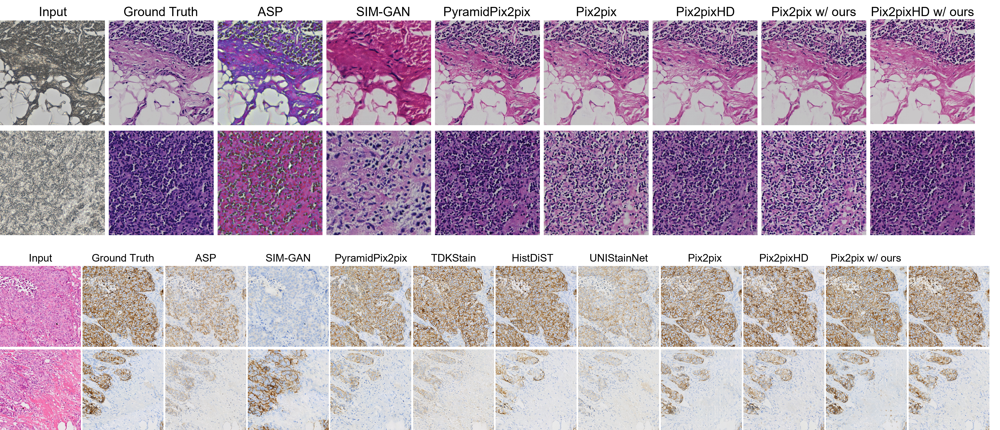

# Towards Generalizable and Robust Virtual Staining via Causal Intervention

Official implementation of **"Towards Generalizable and Robust Virtual Staining via Causal Intervention."**

**Authors:** Weiping Lin, Baoshun Wang, Yihuang Hu, Runchen Zhu, Liansheng Wang  
**Affiliation:** Xiamen University, China

---

## Overview

Virtual staining is an image-to-image translation technique that generates digitally stained pathology images from unstained or differently processed tissue images. Although recent virtual staining methods have achieved promising results under specific experimental settings, their performance may degrade when applied to unseen datasets, different staining conditions, or other real-world variations.

A key challenge is that virtual staining models may learn **spurious correlations** from diagnosis-irrelevant factors, such as staining variability, scanner characteristics, demographic biases, and other dataset-specific variations. These factors can cause models to rely on non-causal information, consequently limiting their generalization and robustness.

In this work, we propose a **causal intervention-based training framework** for virtual staining. From a causal perspective, pathological image features can be divided into diagnosis-relevant and diagnosis-irrelevant components. Our framework introduces a unified strategy to identify diagnosis-irrelevant features through a **confounder space classifier**, and then performs causal intervention during virtual staining training to suppress these spurious features.

The proposed framework is **model-agnostic** and can be integrated into existing virtual staining models in a plug-and-play manner.

We evaluate our method on five datasets covering two clinically relevant virtual staining tasks:

- **H&E-to-IHC**
- **FFPE-to-H&E**

Extensive experiments demonstrate the effectiveness of our approach in improving virtual staining quality, generalization to unseen datasets, and robustness to content-preserving perturbations.

---

## Qualitative Comparison

The following figure presents qualitative comparisons between our proposed method and representative baseline methods for virtual staining. It illustrates the visual results produced by different methods.



---

## Method

### Problem Formulation

Let:

- $S$ denote the source image domain.
- $T$ denote the target staining domain.
- $X$ denote diagnosis-relevant information.
- $C$ denote diagnosis-irrelevant information.

A conventional virtual staining model may learn a biased mapping:

$$
G: S(X,C) \rightarrow T.
$$

Our goal is to learn a more causal mapping that focuses on diagnosis-relevant information:

$$
G: X \rightarrow T.
$$

Instead of explicitly modeling every possible type of nuisance variation, we introduce the concept of a **confounder space**.

Images with similar diagnosis-irrelevant characteristics are considered to belong to the same confounder space. Depending on the available information, confounder spaces can be defined according to factors such as staining characteristics, acquisition site, scanning equipment, or other shared processing conditions.

When explicit nuisance annotations are unavailable, WSI identity can be used to define the confounder space. Images originating from the same WSI are treated as belonging to the same confounder space.

### Confounder Space Classifier

We construct positive and negative image pairs according to confounder-space membership:

- Images from the same confounder space form positive pairs.
- Images from different confounder spaces form negative pairs.
- Additional color transformations are applied to increase the diversity of training pairs.

A pairwise classifier is trained to estimate whether two target images belong to the same confounder space.

The classifier consists of an image encoder and a similarity scorer, which estimate similarity and dissimilarity between image pairs. This design allows the model to capture diagnosis-irrelevant information implicitly, without requiring explicit annotations for every nuisance factor.

### Causal Intervention

After the confounder space classifier has been trained, it is frozen and incorporated into the virtual staining training process.

For an input source image $s_i$, the virtual staining model generates a target image:

$$
\hat{t}_i = G(s_i).
$$

The generated images are evaluated by the frozen confounder space classifier. The virtual staining model is optimized so that its generated outputs become less distinguishable according to their confounder-space information.

This encourages the virtual staining model to suppress diagnosis-irrelevant features while preserving the information required for the staining transformation.

To improve computational efficiency and pair diversity, we further introduce a **queue dictionary** that stores generated target images and dynamically updates its contents during training.

---

## Framework

The overall training procedure consists of two main components.

### 1. Confounder Space Classifier

1. Construct image pairs according to confounder-space membership.
2. Apply color transformations to improve pair diversity.
3. Train a pairwise confounder space classifier.
4. Learn representations that capture diagnosis-irrelevant information.

### 2. Causal Intervention

1. Train the virtual staining model with its original objective.
2. After the warm-up stage, freeze the confounder space classifier.
3. Generate target images using the virtual staining model.
4. Compare generated images using the frozen confounder classifier.
5. Optimize the virtual staining model to suppress confounder-related information.
6. Use a queue dictionary to improve computational efficiency and pair diversity.

The resulting framework can be integrated into different supervised virtual staining architectures.

---

## Supported Tasks

We evaluate the proposed framework on two virtual staining tasks.

### H&E-to-IHC

The H&E-to-IHC experiments focus on HER2 staining and scoring.

The datasets include:

- **BCI**
- **MIST-HER2**
- **self-HER2**

The self-HER2 dataset contains 3,206 accurately aligned H&E/IHC image pairs from 30 pairs of whole-slide images and covers all four HER2 scoring categories:

- 0
- 1+
- 2+
- 3+

Image patches are extracted at 20× magnification with a resolution of $1024 \times 1024$ pixels.

### FFPE-to-H&E

The FFPE-to-H&E experiments include:

- **self-FFPE1**
- **self-FFPE2**

The two datasets were independently collected and processed following nearly identical protocols, with different source institutions. FFPE and H&E images are strictly registered, and image patches are extracted at 40× magnification.

---

## Datasets

The datasets used in our experiments are summarized below.

| Dataset | Task | Train | Test | Public |
| --- | --- | ---: | ---: | :---: |
| BCI | H&E-to-IHC | - | 977 | ✓ |
| MIST-HER2 | H&E-to-IHC | 4,642 | 998 | ✓ |
| self-HER2 | H&E-to-IHC | 2,632 | 574 | ✗ |
| self-FFPE1 | FFPE-to-H&E | 4,232 | 1,075 | ✗ |
| self-FFPE2 | FFPE-to-H&E | - | 1,398 | ✗ |

The train/test numbers describe how the datasets are used in our experiments and do not necessarily indicate the original dataset partitioning.

### Data Availability

The public datasets should be obtained from their respective publications and used in accordance with their licenses.

The private datasets (`self-HER2`, `self-FFPE1`, and `self-FFPE2`) are not distributed with this repository.

Please ensure that you have the necessary permissions before using any dataset.

---

## Baseline Models

We use two representative supervised virtual staining models as baseline architectures:

- **Pix2Pix**
- **Pix2PixHD**

The proposed causal intervention framework is designed to be model-agnostic and can be incorporated into existing virtual staining models.

Our experiments compare the baseline models with their counterparts incorporating the proposed method.

---

## Evaluation

We evaluate generated images using two groups of metrics.

### Image Quality Metrics

The following metrics measure pixel-level fidelity:

- **PSNR** ↑
- **SSIM** ↑
- **MS-SSIM** ↑

Higher values indicate better performance.

### Feature-Based Metrics

The following metrics evaluate perceptual and semantic differences using deep feature representations:

- **FID** ↓
- **KID** ↓
- **DISTS** ↓

Lower values indicate better performance.

---

## Experimental Settings

The implementation is based on **PyTorch 2.0.1**.

The reported experiments were conducted on workstations equipped with:

- 8 × NVIDIA RTX 3090 GPUs
- 24 GB GPU memory per GPU

For the confounder space classifier, we use the following settings:

| Component | Setting |
| --- | --- |
| Backbone | ResNet-18 |
| Training pairs | 50,000 |
| Dictionary length | Approximately 5% of the training set |
| Warm-up | 60 epochs |
| Causal intervention | Activated after warm-up |

The loss weight for suppressing diagnosis-irrelevant features follows the experimental configuration described in the paper.

---

## Repository Structure

The main files and directories are organized as follows:

```text
Causal-Virtual-Staining/
│
├── data/           # Dataset loading and preprocessing
├── models/         # Model architectures and training objectives
├── options/        # Training and testing options
├── scripts/        # Auxiliary scripts
├── util/           # Utility functions
├── docs/           # Documentation
├── imgs/           # Figures and visualization images
│   └── visualization.png
│
├── train.py        # Training entry point
├── test.py         # Testing entry point
├── environment.yml # Environment dependencies
├── LICENSE
└── README.md
```

Datasets, checkpoints, and generated results are not included in this repository.

---

## Installation

We recommend using a dedicated Conda environment.

Create the environment using the provided configuration:

```bash
conda env create -f environment.yml
```

Activate the environment using the environment name specified in `environment.yml`:

```bash
conda activate <environment_name>
```

Please ensure that the installed PyTorch version, CUDA runtime, and NVIDIA driver are compatible with your hardware.

---

## Data Preparation

Download or prepare the required datasets according to their respective access and usage requirements.

Organize the data under the dataset root specified by `--dataroot`. The directory structure and image organization must be consistent with the corresponding dataset loader in this repository.

For example:

```text
datasets/
└── your_dataset/
    ├── ...
    └── ...
```

The datasets are not included in this repository.

---

## Training

To train the Pix2Pix model, use the following command:

```bash
python train.py \
    --dataroot ./datasets/your_dataset \
    --name your_experiment \
    --model pix2pix \
    --direction AtoB
```

Replace the placeholders with your actual dataset directory and experiment name.

**Arguments:**

| Argument | Description |
| --- | --- |
| `--dataroot` | Path to the dataset directory |
| `--name` | Name of the training experiment |
| `--model` | Model architecture; `pix2pix` for Pix2Pix |
| `--direction` | Translation direction; `AtoB` indicates translation from domain A to domain B |

The training configuration and additional options can be adjusted according to the implementation and experimental requirements.

---

## Testing

After training, use the testing entry point and the corresponding model options to generate virtual staining results.

Make sure that the testing data directory and the trained checkpoint correspond to the intended experiment.

---

## Generalization Evaluation

A major focus of this work is **out-of-distribution (OOD) generalization**.

For H&E-to-IHC, models are trained on selected datasets and evaluated on both the corresponding in-distribution test set and external datasets.

For FFPE-to-H&E, models are trained on `self-FFPE1` and evaluated on both `self-FFPE1` and `self-FFPE2`.

This evaluation setting is designed to measure generalization to unseen data distributions.

---

## Robustness Evaluation

In addition to OOD generalization, we evaluate robustness under content-preserving perturbations.

The goal is to investigate whether generated virtual stains remain stable under variations that should not change the underlying pathological content, such as staining intensity variations, image noise, and scanner-related artifacts.

---

## Ablation Study

We conduct ablation experiments to investigate the contribution of causal intervention.

In the ablation experiment, we construct a variant that allows generated images to preserve information associated with their confounder spaces. This comparison is used to examine the role of confounder-related information suppression during virtual staining training.

---

## Citation

If you find this work useful, please cite our paper:

```bibtex
@article{lin2026towards,
  title   = {Towards Generalizable and Robust Virtual Staining via Causal Intervention},
  author  = {Lin, Weiping and Wang, Baoshun and Hu, Yihuang and Zhu, Runchen and Wang, Liansheng},
  journal = {IEEE Transactions on Medical Imaging},
  year    = {2026}
}
```

Please update the bibliographic information according to the final published version of the paper.

---

## License

This project is released under the license specified in `LICENSE`.

Please also check the licenses of third-party components and pretrained models before redistribution or commercial use.

---

## Acknowledgements

We thank the authors of the baseline methods and the providers of the public pathology datasets used in this work.

This work was supported by the National Natural Science Foundation of China under Grant 62371409 and the Fujian Provincial Natural Science Foundation of China under Grant 2023J01005.

---

## Contact

For questions regarding this project, please open an issue in this repository.

For questions related to the paper, please contact:

**Liansheng Wang**  
Xiamen University

---

## Disclaimer

This repository is intended for research purposes.

The proposed method has been evaluated on the datasets and experimental settings described in the accompanying paper. It is not intended to replace clinical diagnosis or professional pathological assessment.
